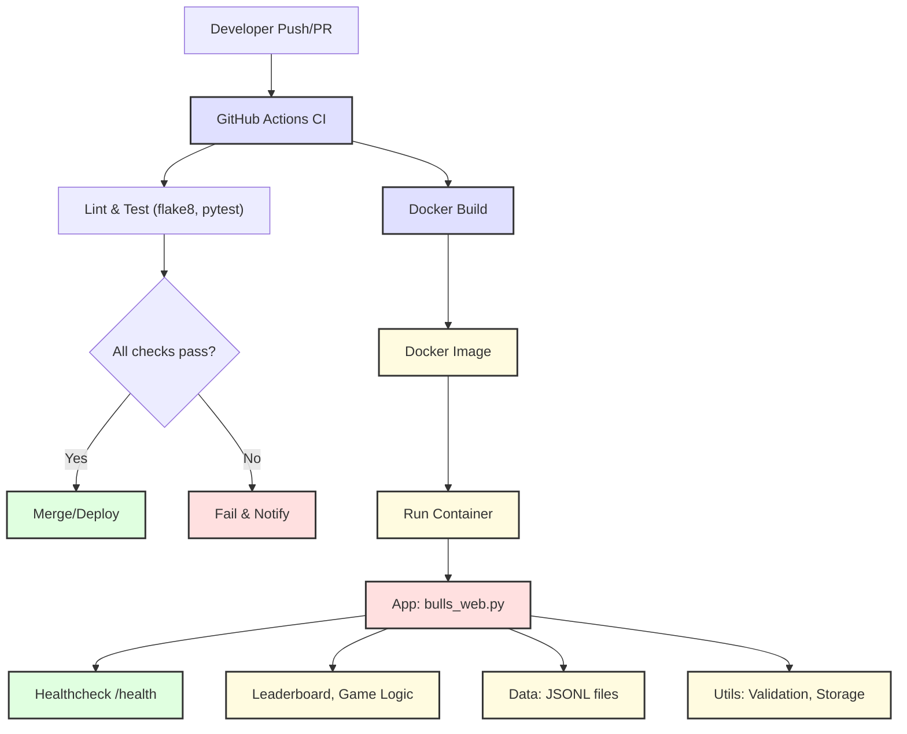
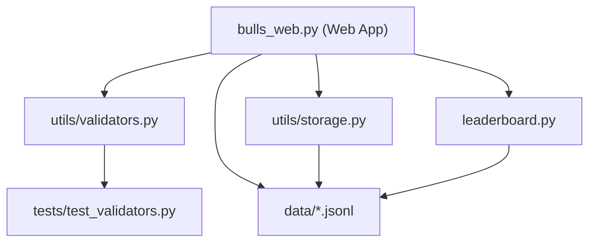

# Project Process Diagrams

## CI/CD Pipeline

```mermaid
flowchart TD
    A["Developer Push/PR"] --> B["GitHub Actions CI"]
    B --> C["Lint & Test (flake8, pytest)"]
    B --> D["Docker Build"]
    C --> E{"All checks pass?"}
    E -- "Yes" --> F["Merge/Deploy"]
    E -- "No" --> G["Fail & Notify"]
    D --> H["Docker Image"]
    H --> I["Run Container"]
    I --> J["App: bulls_web.py"]
    J --> K["Healthcheck /health"]
    J --> L["Leaderboard, Game Logic"]
    J --> M["Data: JSONL files"]
    J --> N["Utils: Validation, Storage"]
    style K fill:#e0ffe0,stroke:#333,stroke-width:2px
    style B fill:#e0e0ff,stroke:#333,stroke-width:2px
    style D fill:#e0e0ff,stroke:#333,stroke-width:2px
    style H fill:#fffbe0,stroke:#333,stroke-width:2px
    style J fill:#ffe0e0,stroke:#333,stroke-width:2px
    style F fill:#e0ffe0,stroke:#333,stroke-width:2px
    style G fill:#ffe0e0,stroke:#333,stroke-width:2px
    style I fill:#fffbe0,stroke:#333,stroke-width:2px
    style L fill:#fffbe0,stroke:#333,stroke-width:2px
    style M fill:#fffbe0,stroke:#333,stroke-width:2px
    style N fill:#fffbe0,stroke:#333,stroke-width:2px
```

## Application Architecture

```mermaid
graph TD
    A["bulls_web.py (Web App)"] --> B["utils/validators.py"]
    A --> C["utils/storage.py"]
    A --> D["leaderboard.py"]
    A --> E["data/*.jsonl"]
    B --> F["tests/test_validators.py"]
    C --> E
    D --> E
``` 